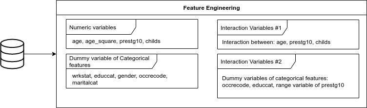

<!-- % Template Version 1.1 -->

<!-- below function does some formatting for images; leave this untouched unless you know better :-) -->

```{r setup, include=FALSE}
knitr::opts_chunk$set(echo = TRUE)
library(magick)
library(tidyverse)
library(stargazer)
crop <- function(im, left = 0, top = 0, right = 0, bottom = 0) {
  d <- dim(im[[1]]); w <- d[2]; h <- d[3]
  image_crop(im, glue::glue("{w-left-right}x{h-top-bottom}+{left}+{top}"))
}
```

# Introduction

In this paper we predict individuals' wages using data from the General Social Survey (GSS, 1974-2018). The variable of interest is `realrinc` which varies between 227\$ and 480,145\$\footnote{In constant 1986 USD.}. Hence, we can use regression techniques to predict individuals' wages. Additionally, we can consider whether `realrinc` varies by gender and if so, how much.

The data from the GSS allow us to consider various control variables such as gender, age, education, occupation, number of children and marital status.

The prediction of individuals' wages has been an issue in previous literature. As wages are relevant to companies they want to know how predict wages [@Chakraborti]. Some papers make use of classification techniques to predict wages [@Chakraborti]. As we have numeric values of real wages and not a categeorical variable we do not make use of classification techniques but prefer linear regression techniques such as OLS and Lasso regressions as well as random forests. We prefer these techniques as they handle categorical variables and outliers well, which are features of our data [@Cutler]. Wages were already predicted using random forests by [@Eichinger]. They find that usnig random forests results in better predictions than using linear models. Additionally, they show that gender barely effects the wage predictions.

Based on the previous literature, we use severall regression techniques to predict `realrinc`:

-   Linear Regression

-   Logistic Regression

-   Lasso, Ridge and Elastic Net Regression

-   Gradient Boosting

-   Random Forest

In order to evaluate which of the regression techniques predicts `realrinc` the best we split the data set into a train (70%) and a test (30%) dataset. We fit the aforementioned regression models on the train data and evaluate the root mean squared error (RMSE) using the validation data. We choose the RMSE as it is more sensitive to large errors [@Arour].


[Write something about cross validation?]

# Data Preparation & Feature Engineering

The initial data set contains 11 variables and a brief description of each variable is presented here:

- **year**: survey year
- **realrinc**: respondent's base income (in constant 1986 USD)
- **age**: respondent's age in years
- **occ10**: respondent's occupation code
- **occrecode**: recode of the occupation code into one of 11 main categories
- **prestg10**: respondent's occupational prestige score
- **childs**: number of children
- **wrkstat**: work status of the respondent (full-time, part-time, temporarily not working, unemployed (laid off), etc)
- **gender**: respondent's gender
- **educcat**: respondent's degree level (Less Than High School, High School, etc)
- **maritalcat**: respondent's marital status (Married, Widowed, Divorced, etc)

## Data Preparation

A data preparation process was carried before the modeling. The initial dataset had 54,842 observations and the outcome variable `realrinc` had 38.55% of missing values. The imputation of the target variable was discarded to avoid generating a bias in the modeling and therefore it was decided to eliminate these records from the original data set. After this, the dataset contained 33,702 observations. Furthermore, it was impossible to deduce the occupation for some observations (`occ10 = 9997`) and these were removed from the dataset. At the end, the final dataset had 33,244 observations, and it was used for the modeling process.

This dataset still had some missing values for the regressors, e.g., number of children, age, marital status, degree level, and others. The imputation process was carried using five variables via `mice` package. The features *age, occupational prestige and number of children* were imputed using the pmm (`predictive mean matching`) method, and whereas the polytomous logistic regression method was used for the factor variables (*education and marital status*). The imputation process used a number of multiple imputations of six, which means that the process had 6 different datasets, and then the estimation of the mean and the majority vote was applied to aggregate the datasets into a single dataset. The mean estimation was applied for the numeric variables and majority vote for the categorical variables..

## Feature Engineering

The interaction variables were created after the imputation process. First, some interaction features were estimated using only the numerical variables, and then the numerical variables were transformed into categorical variables by dividing them into different ranges (e.g. age between 18 and 30, age between 31 and 50, etc). These new categorical variables and the initial categorical variables (*marital status, education, etc*) were transformed into dummy variables. And finally, the interaction variables were estimated with the group of dummy variables mentioned above.
The inclusion of the interaction of the numeric variables were validate using a linear model, and the results showed that the p- values of the parameters for the interactions were less than 0,05.


Furthermore, a correlation matrix using Spearman's rank correlation coefficient was estimated with some numeric variables in order to support the previous results. The correlation results are shown in the following figure.


After the data preparation and feature engineering processes, a final dataset was constructed with 33,244 observations and 421 features. Due to the large number of interaction variables, it was decided to reduce them and use only the interaction between a group of variables (*occrecode, educcat and prestg10*). After reduction, the modeling process was developed with 100 variables (numerical and interaction variables). The following figure shows the overview of the group of variables that were estimated and used in the models.




# Model Training and Tuning

We used five different regression techniques to predict the individuals' wages using the final dataset. We fit every model on our training data using the `train` function from the `caret` package. To choose the best parameter combination we use cross-validation within all train functions.

## Linear and Logistic Regression

Our baseline linear model uses an OLS regression including all interaction variables. This results in an RMSE of 25,506.05.

``` r
formula <- as.formula(paste("realrinc ~", paste(x_cols_dummys, collapse = " + ")))
mod_full <- train(formula,
                  data = train, 
                  method = "lm",  
                  trControl = trainControl(method = "cv"))
```

Given some extreme outliers in the income distribution of our data (which is typical for wage data) we follow the economic literature [@Ermini] and fit a logistic model to our data, using the log of `realrinc` as our dependent variable. This results in a higher RMSE than the linear model (25,909.82).

``` r
formula2 <- as.formula(paste("log_realrinc ~", paste(x_cols_dummys, collapse = " + ")))
mod_loginc <- train(formula2,
                    data = train, 
                    method = "lm",  
                    trControl = trainControl(method = "cv"))
```

In both models the coefficient of female is statistically significant with p \< 0.001. It suggests that being female decreases the real income by approximately 10,192\$ in the linear model or by 40% in the logistic model.

## Subset Selection

As the dataset contains many variables (361) and even our selection of dummy variables for the right-hand side of the regression leaves us with 53 variables, we make use of regression techniques for subset selection. We use lasso, ridge and elastic net regressions. These methods allow us to fit a model that contains all variables. Then the model regularizes the coefficient estimates and shrinks them towards zero. In effect, we reduce the estimates' variance which improves the model fit.

We start with a ridge regression.

$$
RSS + \lambda \sum^p _{j=1} \beta^2_j 
$$

Hence, the coefficient estimates in a ridge regression minimize the sum of the residual sum of squares (RSS) and the sum of squared coefficients multiplied with a tuning parameter $\lambda$. We estimate $\lambda$ using cross-validation.

``` r
ridge <- train(formula, data = train,
  method = "glmnet", trControl = trainControl(method = "cv"),
  tuneGrid = expand.grid(alpha = 0, lambda = seq(0, 500, 1))) 
```

Perform a ridge regression to predict real incomes yields an RMSE of 25,524.85.

In contrast to other subset selection methods ridge regression does not exclude any variables from the regression model. Hence, the model is still fitted on 53 covariates. To overcome this issue we also use a lasso regression.

$$
RSS + \lambda \sum^p_{j=1} | \beta_j |
$$

In contrast to the ridge regression the lasso regression forces some of the coefficient estimates to be equal to zero if $\lambda$ is sufficiently large. Hence, the regression is not performed on all covariates.

``` r
lasso <- train(formula, data = train, 
       method = "glmnet", trControl = trainControl(method = "cv"), 
       tuneGrid = expand.grid(alpha = 1, lambda = seq(0,500,1)))
```

To perform the lasso regression in `R` we set $\alpha$ equal to one. The lasso regression yields a lower RMSE than the ridge regression (25,504.58 vs. 25,524.85) and even a lower RMSE than the linear regression.

In a final step we use elastic net regularization which is a linear combination of ridge and lasso regression. The elastic net regularization allows $\alpha$ to vary between zero and one. This results in an RMSE of 25,241.7.

``` r
elasticnet <- train(formula, data = train,
       method = "glmnet", trControl = trainControl(method = "cv"),
       tuneGrid = expand.grid(alpha = seq(from=0, to=1, by = 0.1),
       lambda = seq(from=0, to=0.15, by = 0.001)))
```
