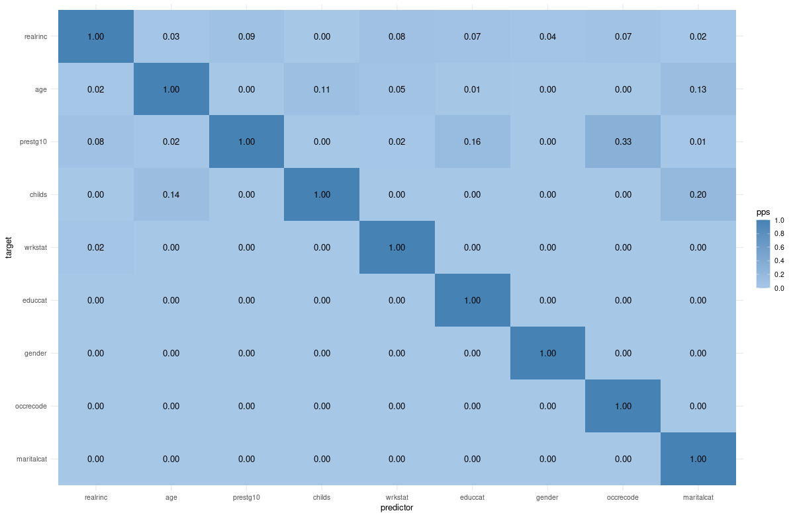
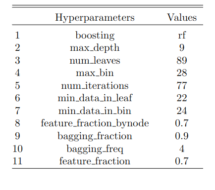
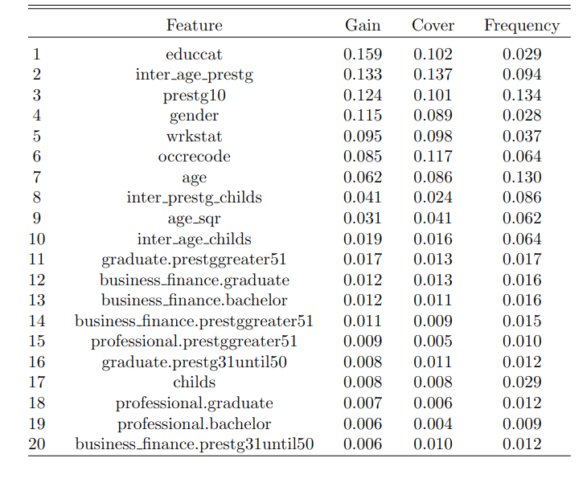
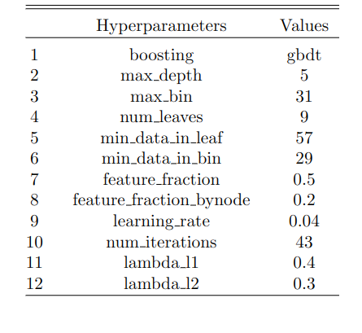
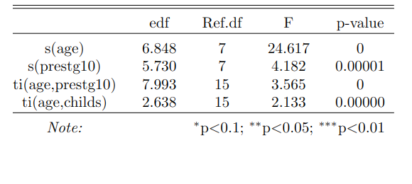

<!-- % Template Version 1.1 -->

<!-- below function does some formatting for images; leave this untouched unless you know better :-) -->

```{r setup, include=FALSE}
knitr::opts_chunk$set(echo = TRUE)
library(magick)
library(tidyverse)
library(stargazer)
crop <- function(im, left = 0, top = 0, right = 0, bottom = 0) {
  d <- dim(im[[1]]); w <- d[2]; h <- d[3]
  image_crop(im, glue::glue("{w-left-right}x{h-top-bottom}+{left}+{top}"))
}
```

# Introduction

In this paper we predict individuals' wages using data from the General Social Survey (GSS, 1974-2018). The variable of interest is `realrinc` which varies between 227\$ and 480,145\$\footnote{In constant 1986 USD.}. Hence, we can use regression techniques to predict individuals' wages. Additionally, we can consider whether `realrinc` varies by gender and if so, how much.

The data from the GSS allow us to consider various control variables such as gender, age, education, occupation, number of children and marital status.

The prediction of individuals' wages has been an issue in previous literature. As wages are relevant to companies they want to know how to predict wages [@Chakraborti]. Some papers make use of classification techniques to predict wages [@Chakraborti]. As we have numeric values of real wages and not a categorical variable we do not make use of classification techniques but prefer linear regression techniques such as OLS and Lasso regressions as well as random forests. We prefer these techniques as they handle categorical variables and outliers well, which are features of our data [@Cutler]. Wages were already predicted using random forests by [@Eichinger]. They find that using random forests results in better predictions than using linear models. Additionally, they show that gender barely effects the wage predictions. Likewise, the boosting methods used by [@Chakrabarty2018] in salary level classification problems showed better performance compared to a traditional algorithm such as support vector machines (SVM). Furthermore, @BonaccoltoToepfer1612 suggest the use of a penalization approach for high dimensional problems in his research about gender wage inequality.

Based on the previous literature, we use several regression techniques to predict `realrinc`:

-   Linear Regression

-   Logistic Regression

-   Lasso, Ridge and Elastic Net Regression

-   Random Forest

-   Gradient Boosting

-   Generalized Additive Model

In order to evaluate which of the regression techniques predicts `realrinc` the best we split the data set into a train (70%) and a test (30%) data set. We fit the aforementioned regression models on the train data and evaluate the root mean squared error (RMSE) using the validation data. We choose the RMSE as it is more sensitive to large errors [@Arour].

Furthermore, we use cross validation (CV) to assess the performance of a model and to select appropriate hyperparameters. CV prevents overfitting and helps in model selection.

# Data Preparation & Feature Engineering

The initial data set contains 11 variables, which are described in the following:

-   **year**: survey year

-   **realrinc**: respondent's base income (in constant 1986 USD)

-   **age**: respondent's age in years

-   **occ10**: respondent's occupation code

-   **occrecode**: recode of the occupation code into one of 11 main categories

-   **prestg10**: respondent's occupational prestige score

-   **childs**: number of children

-   **wrkstat**: work status of the respondent (full-time, part-time, temporarily not working, unemployed (laid off), etc.)

-   **gender**: respondent's gender

-   **educcat**: respondent's degree level (Less Than High School, High School, etc.)

-   **maritalcat**: respondent's marital status (Married, Widowed, Divorced, etc.)

## Data Preparation

Before modeling we conduct a data preparation process. The initial data set has 54,842 observations and the outcome variable `realrinc` has 38.55% of missing values. The imputation of the target variable is discarded to avoid generating a bias in the modeling and therefore we eliminate these records from the original data set. After this, the data set contains 33,702 observations. Furthermore, it is impossible to deduce the occupation for some observations (`occ10 = 9997`) and we remove these from the data set. Finally, the data set has 33,244 observations and we use it for the modeling process.

This data set still has some missing values for the regressors, e.g., number of children, age, marital status, degree level, and others. Thus, we use the `mice` package with five variables for the imputation process. The features *age, occupational prestige and number of children* are imputed using the predictive mean matching (pmm) method, and we use the polytomous logistic regression method for the factor variables (*education and marital status*). As we use a value of 6 in the `m` parameter of the `mice` function, the imputation process generates 6 different data sets. This parameter refers to the number of imputed data sets. After this, we apply the calculation of the mean and the majority vote to aggregate the data sets into one. Mean estimation is applied for numerical variables and majority voting for categorical variables

## Feature Engineering

After the imputation process, we create interaction variables. First, we estimate some interaction features using only the numerical variables. Then, we transform the numerical variables (`age, childs and prestg10`) into categorical variables by separating them into ranges. The ranges created of these variables were: `age between 18 and 30, age between 31 and 50`, `age greater than 50; childs between 0 and 2, childs between 3 and 5, childs more than 5; prestg10 between 16 and 30, prestg10 between 31 and 50, prestg10 greater than 50`. After this, we transform these new categorical variables and the initial categorical variables (`marital status`, `education`, etc.) into dummy variables. Finally, we estimate the interaction variables with the group of dummy variables mentioned above (the interaction consists of the multiplication between two dummy variables). The inclusion of the interactions of the numeric variables is validate using a linear model, and the results show that the p-values of the parameters for the interactions are below 0.05.

{width="317"}

Furthermore, we estimate a correlation matrix using Spearman's rank correlation coefficient with some numeric variables in order to support the previous results. The correlation results are exposed in figure 2, and show that `prestg10`, `age` and `interaction between age and prest10` have the highest positive correlation with `realrinc`, meanwhile the dummy variable `female` has a moderate negative correlation with the target variable.


As the correlation assesses the linear relationship between two variables and it only uses numerical features, we additionally estimate the Predictive Power Score (PPS). It overcomes these limitations and allows us to assess the predictive power of a regressor on a target variable. This measure is a normalized metric and its values are between 0 (no predictive power) and 1 (perfect predictive power). The PPS is calculated by comparing the performance of a model that uses a regressor `x` to predict target variable `y` versus the performance of a base model (naive). When the target variable is a numerical feature it is common to use a Decision Tree Regressor to predict `y` based on `x`, while in categorical cases a Decision Tree Classifier is used. On the other hand, base models are often defined as mean prediction or random or modal prediction for regression and classification problems, respectively. The PPS results are presented in figure 3, and show that `prestg10`, `wrkstat`, `educcat` and `occrecode` have the highest predictive power of `realrinc` relative to the other features. These results provide some insights in the data exploration process, but we must beware of the limitations of this approach.



After the data preparation and feature engineering processes, we have a final data set with 33,244 observations and 421 features. Due to the large number of interaction variables, we reduce them and use only the interaction between a group of variables (`occrecode`, `educcat` and categorical variable of `prestg10`). After this, we develop the modeling process with 100 variables (numerical and interaction variables). Figure 4 shows the overview of the group of estimated variables that are used in the models.


# Model Training and Tuning

We use five different regression techniques to predict the individuals' wages using the final data set. We fit every model on our training data using the `train` function from the `caret` package. To choose the best parameter combination we use cross-validation within all train functions.

## Linear and Logistic Regression

Our baseline linear model uses an OLS regression including all interaction variables. This results in an RMSE of 25,506.05.

``` r
formula <- as.formula(paste("realrinc ~", 
                            paste(x_cols_dummys, collapse = " + ")))
mod_full <- train(formula,
                  data = train, 
                  method = "lm",  
                  trControl = trainControl(method = "cv", number = 3))
```

Given some extreme outliers in the income distribution of our data (which is typical for wage data) we follow the economic literature [@Ermini] and fit a logistic model to our data, using the log of `realrinc` as our dependent variable. This results in a higher RMSE than the linear model (25,909.82). Still, the linear model yields predictions of `realrinc` that are negative, what is implausible. Using the log of `realrinc` only positive predictions are generated. Therefore, we prefer using the log for the following predictions.

``` r
formula2 <- as.formula(paste("log_realrinc ~", 
                              paste(x_cols_dummys, collapse = " + ")))
mod_loginc <- train(formula2,
                    data = train, 
                    method = "lm",  
                    trControl = trainControl(method = "cv", number = 3)
```

In both models the coefficient of female is statistically significant with p \< 0.001. It suggests that being female decreases the real income by approximately 10,192\$ in the linear model or by 40% in the logistic model.

## Subset Selection

As the data set contains many variables (361) and even our selection of dummy variables for the right-hand side of the regression leaves us with 53 variables, we make use of regression techniques for subset selection. We use lasso, ridge and elastic net regressions. These methods allow us to fit a model that contains all variables. Then the model regularizes the coefficient estimates and shrinks them towards zero. In effect, we reduce the estimates' variance which improves the model fit.

We start with a ridge regression.

$$
y = RSS + \lambda \sum^p _{j=1} \beta^2_j 
$$

Hence, the coefficient estimates in a ridge regression minimize the sum of the residual sum of squares (RSS) and the sum of squared coefficients multiplied with a tuning parameter $\lambda$. We estimate $\lambda$ using CV.

``` r
ridge <- train(formula, data = train,
  method = "glmnet", trControl = trainControl(method = "cv", number = 3),
  tuneGrid = expand.grid(alpha = 0, lambda = seq(0,1,0.001)))
```

Performing a ridge regression to predict real incomes yields an RMSE of 26,062.58.

In contrast to other subset selection methods ridge regression does not exclude any variables from the regression model. Hence, the model is still fitted on 53 covariates. To overcome this issue we also use a lasso regression.

$$
RSS + \lambda \sum^p_{j=1} | \beta_j |
$$

In contrast to the ridge regression the lasso regression forces some of the coefficient estimates to be equal to zero if $\lambda$ is sufficiently large. Hence, the regression is not performed on all covariates.

``` r
lasso <- train(formula, data = train, 
       method = "glmnet", trControl = trainControl(method = "cv"), 
       tuneGrid = expand.grid(alpha = 1, lambda = seq(0,1,0.001)))
```

To perform the lasso regression in `R` we set $\alpha$ equal to one. The lasso regression yields a lower RMSE than the ridge regression (25,918.25 vs. 26,062.58).

In a final step we use elastic net regularization which is a linear combination of ridge and lasso regression. The elastic net regularization allows $\alpha$ to vary between zero and one. This results in an RMSE of 25,918.81.

``` r
elasticnet <- train(formula, data = train,
       method = "glmnet", trControl = trainControl(method = "cv"),
       tuneGrid = expand.grid(alpha = seq(from=0, to=1, by = 0.1),
       lambda = seq(from=0, to=0.15, by = 0.001)))
```

## Random Forest

According to the literature review, tree-based models perform considerably well in predicting income ranges (classification problems) [@Chakrabarty2018]. For this reason, we use the random forest algorithm for modeling. For this method we use income without logarithm transformation, initial variables and some interaction variables. Due to the amount of hyperparameters in random forest, we use the `lightgbm` and `mlr3` packages to model and tune the hyperparameter in a time-optimal way. We tune the hyperparameters `max_depth`, `num_leaves`, `num_iterations`, etc. to find the best hyperparameters that produce the lowest error. The search space of the hyperparameters is showed below. In addition, we use a random search approach in the tuning process with a CV of 3 folds.

``` r
tnr_rdgrid_search = tnr("random_search", batch_size = 10)
rsmp_cv3 = rsmp("cv", folds = 3)
msr_ce = msr("regr.rmse")
learner = lrn("regr.lightgbm",
              boosting = "rf",
              objective = "regression",
              max_depth = to_tune(seq(5,12,1)),
              num_leaves = to_tune(seq(270,280,1)),
              num_iterations  = to_tune(seq(132,137,1)),
              min_data_in_leaf = to_tune(seq(70,85,1)),
              min_data_in_bin = to_tune(seq(10,15, 1)),
              feature_fraction_bynode = to_tune(seq(0.3,0.4,0.1)),
              bagging_fraction = to_tune(seq(0.2,0.3,0.1)),
              bagging_freq = to_tune(seq(3,5,1)),
              feature_fraction = to_tune(seq(0.7,0.9,0.1)),
              convert_categorical = TRUE,
              force_col_wise = TRUE,
              verbose = 1,
              num_threads = 5
)

instance.rf = tune(
  tuner = tnr_rdgrid_search,
  task = task,
  learner = learner,
  resampling = rsmp_cv3,
  measures = msr_ce,
  term_evals = 300,
  store_models = FALSE
)
```

After identifying the model along with the hyperparameters with lowest error in CV, we proceed to evaluate this model on the test data set and obtain an RMSE of 31,745.54. The hyperparameters of the best model are shown in figure 5.


```{r, echo=FALSE, out.width="50%", fig.cap="Best Hyperparameters for Random Forest"}

```

In addition, we analyze the features importance within the modeling process using random forest. These results are exposed in the figure 6.



Unlike the linear models presented previously, random forest does not predict negative values when logarithmic transformation is not used. Still, we additionally use a random forest with the logarithmic transformation in the target variable and keep the same configuration (CV of 3 folds and random search approach in the tuning process).

``` r
learner.wlog = lrn("regr.lightgbm",
              boosting = "rf",
              objective = "regression",
              max_depth = to_tune(seq(7,12,1)),
              num_leaves = to_tune(seq(120,140,1)),
              max_bin = to_tune(seq(45,60,1)),
              num_iterations  = to_tune(seq(50,90,1)),
              min_data_in_leaf = to_tune(seq(20,35,1)), 
              min_data_in_bin = to_tune(seq(35,50, 1)),
              feature_fraction_bynode = to_tune(seq(0.4,0.7,0.1)),
              bagging_fraction = to_tune(seq(0.6,0.9,0.1)),
              bagging_freq = to_tune(seq(3,12,1)),
              feature_fraction = to_tune(seq(0.8,0.9,0.1)),
              convert_categorical = TRUE,
              force_col_wise = TRUE,
              verbose = 1,
              num_threads = 5,
              seed = 123
)
```

The best model using the logarithmic transformation has different hyperparameters relative to the previous experiment and obtains an RMSE of 34,293.33 on the test data set. Thus, the error of this model is greater than the best model without the transformation (31,745.54).

## Gradient Boosting

Gradient Boosting has a similar amount of hyperparameters as random forest and we use a similar configuration as the previous algorithm to find the best model with the hyperparameters (random search approach in the tuning process with 3-fold CV). The first model with Gradient Boosting uses the target variable without logarithmic transformation.

``` r
tnr_rdgrid_search = tnr("random_search", batch_size = 10)
rsmp_cv3 = rsmp("cv", folds = 3)
msr_ce = msr("regr.rmse")
learner.gb = lrn("regr.lightgbm",
                 boosting = "gbdt",
                 objective = "regression",
                 max_depth = to_tune(seq(3, 6, 1)),
                 num_leaves = to_tune(seq(6,8,1)),
                 min_data_in_leaf = to_tune(seq(39,45,1)),
                 min_data_in_bin = to_tune(seq(8,11,1)),
                 feature_fraction = to_tune(seq(0.3,0.5,0.1)),
                 feature_fraction_bynode = to_tune(seq(0.1,0.2,0.1)),
                 learning_rate = to_tune(seq(0.03, 0.04, 0.01)),
                 num_iterations  = to_tune(seq(39,45,1)),
                 lambda_l1 = to_tune(seq(0.4, 0.5, 0.1)),
                 lambda_l2 = to_tune(seq(0.30, 0.33, 0.01)),
                 convert_categorical = TRUE,
                 force_col_wise = TRUE,
                 verbose = 1,
                 num_threads = 5
)

instance.gb = tune(
  tuner = tnr_rdgrid_search,
  task = task,
  learner = learner.gb,
  resampling = rsmp_cv3,
  measures = msr_ce,
  term_evals = 300,
  store_models = FALSE
)
```

Our best model uses a combination of hyperparamters that produces the least error. We adjust some hyperparameters such as `max_depth`, `num_leaves`, `min_data_in_leaf`, `feature_fraction` and others. We evaluate the best model with the test data set and obtain an RMSE of 29,207.55. The hyperparameters of the best model are shown in figure 7.

```{r, echo=FALSE, out.width="50%", fig.cap="Best Hyperparameters for Gradient Boosting"}

```

Gradient Boosting also provides information on the importance of features during the modeling process in this experiment. Figure 8 shows the 20 most important variables according to the Gini metric. `Gender` is after work status the most important variable, giving additional evidence for a gender pay gap.


Furthermore, we estimate a gradient boosting model using the logarithm transformation on the target variable.

``` r
learner.gb.wlog = lrn("regr.lightgbm",
                 boosting = "gbdt",
                 objective = "regression",
                 max_depth = to_tune(seq(5, 12, 1)),
                 max_bin = to_tune(seq(35,60,1)), 
                 num_leaves = to_tune(seq(19,30,1)),
                 min_data_in_leaf = to_tune(seq(30,50,1)),
                 min_data_in_bin = to_tune(seq(20,45,1)),
                 feature_fraction = to_tune(seq(0.3,0.8,0.1)),
                 feature_fraction_bynode = to_tune(seq(0.7,0.9,0.1)),
                 learning_rate = to_tune(seq(0.01, 0.1, 0.01)), 
                 num_iterations  = to_tune(seq(60,80,1)), 
                 lambda_l1 = to_tune(seq(0.01, 0.1, 0.01)),
                 lambda_l2 = to_tune(seq(0.3, 0.45, 0.01)),
                 convert_categorical = TRUE,
                 force_col_wise = TRUE,
                 verbose = 1,
                 num_threads = 5,
                 seed = 123
)

```

The best model using the logarithmic transformation has an RMSE of 34,385.47 on the test data set. Thus, the error of this model is greater relative to the best model without the transformation (29,207.55). These results show that in tree-based methods, Gradient Boosting has a dominant performance over Random Forest. In other words, the error of Gradient Boosting is about 8% smaller than the error of Random Forest when the logarithmic transformation is not used. Nevertheless, the errors of these models are larger than those of the linear models.

## Generalized Additive Model

Generalized additive models (GAM) could be considered the next step of the linear model because they allow combining nonlinear functional forms of the features along with a linear part. This approach is based on relating the nonlinear predictors with a link function $g(.)$ of the expected values $E(y)$. The following formulas offer more details about this approach.

$$
y \sim \text{ExpoFam}(\mu, \text{etc.})
$$ $$
E(y) = \mu
$$ $$
g(\mu) = b_0 + f(x_1) + f(x_2) + \dots + f(x_p)
$$ The main difference with Generalized Lineal Models (GLM) is that this approach allows linear features to aggregate smooth functions $f(.)$ of the required variables and thus establish nonlinear relationships between regressors and the dependent variable. We use the `gam` and `mlr3` packages to model the GLM. The adjusted hyperparameter is `gamma` and is responsible for producing a smoother term. An additional penalization on the smooth term is aggregated with the parameter `select`. In addition, we use a 3-fold CV in the training stage for this algorithm. We use the logarithmic transformation of the target variable, the interaction variables, smooth terms for the features `age` and `prestg10` with cubic regression splines `cr` and a value of 9 for the knots `k` (number of sections into which a feature is divided). The smooth tensor product for the variables `age`, `prestg10` and `child` uses a thin-plate regression spline `tp` and a knot value of 1. The last smooth term is considered as the interaction between two features to predict the target variables.

``` r
form.str.gam <- paste("log_realrinc ~ s(age, bs = 'cr', k = 9) 
                                    + s(prestg10, bs = 'cr', k=9) + 
                        ti(age,prestg10) + ti(age,childs) +",
                       paste( x_cols_dummys, collapse = " + ") )
form.format.gam <- as.formula(form.str.gam)
learner.gam.wlog.smooth.tensor = lrn("regr.gam",
                                     family = 'gaussian',
                                     select = TRUE,
                                     gamma = to_tune(seq(1,3,0.5)),
                                     formula = form.format.gam
)
```

The best model obtaines an RMSE of 25,856.76 on the test data set. Thus, the error of this model is slightly lower in relation to the linear model that also uses the logarithmic transformation (25,909.82). In other words, it is 0.20% better than the initial linear model. Figure 9 exposes the approximate significance of the smooth terms, and the results show that all the smooth terms used in the model have a p-value of less than 0.01.

```{r, echo=FALSE, out.width="80%", fig.cap="Approximate Significance of Smooth Terms"}

```


# Evaluation

The aim of this paper is to predict individuals' wages. In order to evaluate the best prediction method we use the RMSE. The following table demonstrates the RMSE for each used method: \medskip

```{=tex}
\begin{tabular}{l c} 
\textbf{Method} & \textbf{RMSE} \\ 
Linear Regression & 25,506.05 \\ 
Logistic Regression & 25,909.82 \\ 
Ridge & 26,062.58 \\ 
Lasso & 25,918.25 \\
Elastic Net & 25,918.81 \\ 
Random Forest & 31,745.54 \\ 
Gradient Boosting & 29,207.55 \\ 
Generalized Additive Model & 25,856.76 \\
\end{tabular}
```
\medskip

Conclusively, the linear regression yields the lowest RMSE and thus appears to be the best prediction method. Still, it delivers negative predictions of the wage. Therefore, we prefer the logistic regression. Comparing the RMSE of the logistic model to the one of the GAM, the GAM (which presents a combination of linear and nonlinear functional forms of the features) produces the lowest RMSE. Hence, the GAM presents the best prediction method for real wages (in our data set).

Moreover, the different prediction methods consider `gender` as an important determinant for predicting the individuals' real wage. Still, as we do not use any causal methods other unobserved factors might influence the wage more than `gender`.


\pagebreak

\addcontentsline{toc}{section}{References}
\printbibliography[title = References]
\cleardoublepage

\begin{refsection}
\nocite{R-base}
\nocite{R-Studio}


\end{refsection}
