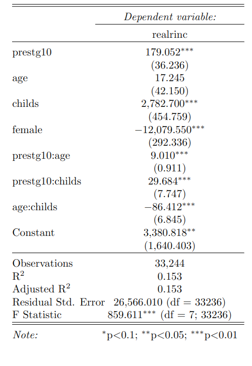

<!-- % Template Version 1.1 -->

<!-- below function does some formatting for images; leave this untouched unless you know better :-) -->

```{r setup, include=FALSE}
knitr::opts_chunk$set(echo = TRUE)
library(magick)
library(tidyverse)
library(stargazer)
crop <- function(im, left = 0, top = 0, right = 0, bottom = 0) {
  d <- dim(im[[1]]); w <- d[2]; h <- d[3]
  image_crop(im, glue::glue("{w-left-right}x{h-top-bottom}+{left}+{top}"))
}
```

# Introduction

In this paper we predict individuals' wages using data from the General Social Survey (GSS, 1974-2018). The variable of interest is `realrinc` which varies between 227\$ and 480,145\$\footnote{In constant 1986 USD.}. Hence, we can use regression techniques to predict individuals' wages. Additionally, we can consider whether `realrinc` varies by gender and if so, how much.

The data from the GSS allow us to consider various control variables such as gender, age, education, occupation, number of children and marital status.

The prediction of individuals' wages has been an issue in previous literature. As wages are relevant to companies they want to know how predict wages [@Chakraborti]. Some papers make use of classification techniques to predict wages [@Chakraborti]. As we have numeric values of real wages and not a categorical variable we do not make use of classification techniques but prefer linear regression techniques such as OLS and Lasso regressions as well as random forests. We prefer these techniques as they handle categorical variables and outliers well, which are features of our data [@Cutler]. Wages were already predicted using random forests by [@Eichinger]. They find that using random forests results in better predictions than using linear models. Additionally, they show that gender barely effects the wage predictions. Likewise, the boosting methods used by [@Chakrabarty2018] in salary level classification problems showed better performance compared to a traditional algorithm such as SVM. Furthermore, [@BonaccoltoToepfer1612] suggests the use of a penalization approach for high dimensional problems in his research about Gender wage inequality.

Based on the previous literature, we use several regression techniques to predict `realrinc`:

-   Linear Regression

-   Logistic Regression

-   Lasso, Ridge and Elastic Net Regression

-   Gradient Boosting

-   Random Forest

In order to evaluate which of the regression techniques predicts `realrinc` the best we split the data set into a train (70%) and a test (30%) data set. We fit the aforementioned regression models on the train data and evaluate the root mean squared error (RMSE) using the validation data. We choose the RMSE as it is more sensitive to large errors [@Arour].

[Write something about cross validation?]

# Data Preparation & Feature Engineering

The initial data set contains 11 variables, which are described in the following:

-   **year**: survey year
-   **realrinc**: respondent's base income (in constant 1986 USD)
-   **age**: respondent's age in years
-   **occ10**: respondent's occupation code
-   **occrecode**: recode of the occupation code into one of 11 main categories
-   **prestg10**: respondent's occupational prestige score
-   **childs**: number of children
-   **wrkstat**: work status of the respondent (full-time, part-time, temporarily not working, unemployed (laid off), etc.)
-   **gender**: respondent's gender
-   **educcat**: respondent's degree level (Less Than High School, High School, etc.)
-   **maritalcat**: respondent's marital status (Married, Widowed, Divorced, etc.)

## Data Preparation

Before modeling we conduct a data preparation process. The initial data set has 54,842 observations and the outcome variable `realrinc` has 38.55% of missing values. The imputation of the target variable is discarded to avoid generating a bias in the modeling and therefore we decided to eliminate these records from the original data set. After this, the dataset contains 33,702 observations. Furthermore, it is impossible to deduce the occupation for some observations (`occ10 = 9997`) and we remove these from the data set. At the end, the final data set has 33,244 observations, and we use it for the modeling process.

This data set still had some missing values for the regressors, e.g., number of children, age, marital status, degree level, and others. We use the `mice` package with five variables for the imputation. The features *age, occupational prestige and number of children* are imputed using the pmm (`predictive mean matching`) method. We use the polytomous logistic regression method for the factor variables (*education and marital status*). The imputation process generates 6 different data sets. We apply the estimation of the mean and the majority vote to aggregate the data sets into a single data set. The mean estimation is applied for the numeric variables and majority vote for the categorical variables..

## Feature Engineering

After the imputation process, we create the interaction variables. First, we estimate some interaction features using only the numerical variables. Then, we transform the numerical variables into categorical variables by dividing them into different ranges (e.g., age between 18 and 30, age between 31 and 50, etc.). We transform these new categorical variables and the initial categorical variables (*marital status, education, etc.*) into dummy variables. And finally, the interaction variables are estimated with the group of dummy variables mentioned above. The inclusion of the interaction of the numeric variables are validate using a linear model, and the results show that the p- values of the parameters for the interactions are less than 0.05.

{width="317"}

Furthermore, we estimate a correlation matrix using Spearman's rank correlation coefficient with some numeric variables in order to support the previous results. The correlation results are shown in the following figure.


After the data preparation and feature engineering processes, we construct a final data set with 33,244 observations and 421 features. Due to the large number of interaction variables, we decided to reduce them and use only the interaction between a group of variables (*occrecode, educcat and prestg10*). After reduction, we develop the modeling process with 100 variables (numerical and interaction variables). The following figure shows the overview of the group of variables that were estimated and used in the models.


# Model Training and Tuning

We use five different regression techniques to predict the individuals' wages using the final data set. We fit every model on our training data using the `train` function from the `caret` package. To choose the best parameter combination we use cross-validation within all train functions.

## Linear and Logistic Regression

Our baseline linear model uses an OLS regression including all interaction variables. This results in an RMSE of 25,506.05.

``` r
formula <- as.formula(paste("realrinc ~", 
                            paste(x_cols_dummys, collapse = " + ")))
mod_full <- train(formula,
                  data = train, 
                  method = "lm",  
                  trControl = trainControl(method = "cv", number = 3))
```

Given some extreme outliers in the income distribution of our data (which is typical for wage data) we follow the economic literature [@Ermini] and fit a logistic model to our data, using the log of `realrinc` as our dependent variable. This results in a higher RMSE than the linear model (25,909.82).

``` r
formula2 <- as.formula(paste("log_realrinc ~", 
                              paste(x_cols_dummys, collapse = " + ")))
mod_loginc <- train(formula2,
                    data = train, 
                    method = "lm",  
                    trControl = trainControl(method = "cv", number = 3)
```

In both models the coefficient of female is statistically significant with p \< 0.001. It suggests that being female decreases the real income by approximately 10,192\$ in the linear model or by 40% in the logistic model.

## Subset Selection

As the dataset contains many variables (361) and even our selection of dummy variables for the right-hand side of the regression leaves us with 53 variables, we make use of regression techniques for subset selection. We use lasso, ridge and elastic net regressions. These methods allow us to fit a model that contains all variables. Then the model regularizes the coefficient estimates and shrinks them towards zero. In effect, we reduce the estimates' variance which improves the model fit.

We start with a ridge regression.

$$
RSS + \lambda \sum^p _{j=1} \beta^2_j 
$$

Hence, the coefficient estimates in a ridge regression minimize the sum of the residual sum of squares (RSS) and the sum of squared coefficients multiplied with a tuning parameter $\lambda$. We estimate $\lambda$ using cross-validation.

``` r
ridge <- train(formula, data = train,
  method = "glmnet", trControl = trainControl(method = "cv", number = 3),
  tuneGrid = expand.grid(alpha = 0, lambda = seq(0, 500, 1))) 
```

Perform a ridge regression to predict real incomes yields an RMSE of 25,524.85.

In contrast to other subset selection methods ridge regression does not exclude any variables from the regression model. Hence, the model is still fitted on 53 covariates. To overcome this issue we also use a lasso regression.

$$
RSS + \lambda \sum^p_{j=1} | \beta_j |
$$

In contrast to the ridge regression the lasso regression forces some of the coefficient estimates to be equal to zero if $\lambda$ is sufficiently large. Hence, the regression is not performed on all covariates.

``` r
lasso <- train(formula, data = train, 
       method = "glmnet", trControl = trainControl(method = "cv"), 
       tuneGrid = expand.grid(alpha = 1, lambda = seq(0,500,1)))
```

To perform the lasso regression in `R` we set $\alpha$ equal to one. The lasso regression yields a lower RMSE than the ridge regression (25,504.89 vs. 25,524.85) and even a lower RMSE than the linear regression.

In a final step we use elastic net regularization which is a linear combination of ridge and lasso regression. The elastic net regularization allows $\alpha$ to vary between zero and one. This results in an RMSE of 25,504.18.

``` r
elasticnet <- train(formula, data = train,
       method = "glmnet", trControl = trainControl(method = "cv"),
       tuneGrid = expand.grid(alpha = seq(from=0, to=1, by = 0.1),
       lambda = seq(from=0, to=0.15, by = 0.001)))
```

## Random Forest

According to the literature review, tree-based models perform considerably well in range in predicting income ranges (classification problems). For this reason, the Random forest algorithm is used for modeling. This experiment use the income without logarithm transformation, the initial features and some interaction variables.

``` r
tnr_rdgrid_search = tnr("random_search", batch_size = 10)
rsmp_cv3 = rsmp("cv", folds = 3)
msr_ce = msr("regr.rmse")
learner = lrn("regr.lightgbm",
              boosting = "rf",
              objective = "regression",
              max_depth = to_tune(seq(5,12,1)),
              num_leaves = to_tune(seq(270,280,1)),
              num_iterations  = to_tune(seq(132,137,1)),
              min_data_in_leaf = to_tune(seq(70,85,1)),
              min_data_in_bin = to_tune(seq(10,15, 1)),
              feature_fraction_bynode = to_tune(seq(0.3,0.4,0.1)),
              bagging_fraction = to_tune(seq(0.2,0.3,0.1)),
              bagging_freq = to_tune(seq(3,5,1)),
              feature_fraction = to_tune(seq(0.7,0.9,0.1)),
              convert_categorical = TRUE,
              force_col_wise = TRUE,
              verbose = 1,
              num_threads = 5
)

instance.rf = tune(
  tuner = tnr_rdgrid_search,
  task = task,
  learner = learner,
  resampling = rsmp_cv3,
  measures = msr_ce,
  term_evals = 150,
  store_models = FALSE
)
```

Due to the number of hyper parameters in Random Forest, we use the `lightgbm` and `mlr3` packages to model and tune the hyper parameter in a time-optimal way. After many attempts, we found the best hyper parameters that produced the lowest error. The hyper parameters tuned were `max_depth`, `num_leaves`, `num_iterations` and others. In addition, we used a random search approach in the tuning process with a cross-validation of 3.
Once we found the model along with the hyper parameters with lowest error in the cross-validation, we proceeded to evaluate this model on the test data set and obtained a RMSE of 31745.54. The hyper parameters of the best model are shown in the following table.

[best hyper parameter of RF]

In addition, we can analyze the importance of the features within the modeling process using Random Forest, and these results are shown in the following table.

[feature importance of RF]


## Gradient Boosting

Gradient Boosting also has many hyper parameters like Random Forest and we decided to apply a similar approach to the previous algorithm to find the best model with the hyper parameters (random search approach in the tuning process with a cross-validation of 3). Furthermore, the experiments with Gradient Boosting used the target variable without logarithm transformation.

``` r
tnr_rdgrid_search = tnr("random_search", batch_size = 10)
rsmp_cv3 = rsmp("cv", folds = 3)
msr_ce = msr("regr.rmse")
learner.gb = lrn("regr.lightgbm",
                 boosting = "gbdt",
                 objective = "regression",
                 max_depth = to_tune(seq(3, 6, 1)),
                 num_leaves = to_tune(seq(6,8,1)),
                 min_data_in_leaf = to_tune(seq(39,45,1)),
                 min_data_in_bin = to_tune(seq(8,11,1)),
                 feature_fraction = to_tune(seq(0.3,0.5,0.1)),
                 feature_fraction_bynode = to_tune(seq(0.1,0.2,0.1)),
                 learning_rate = to_tune(seq(0.03, 0.04, 0.01)),
                 num_iterations  = to_tune(seq(39,45,1)), #40
                 lambda_l1 = to_tune(seq(0.4, 0.5, 0.1)),
                 lambda_l2 = to_tune(seq(0.30, 0.33, 0.01)),
                 convert_categorical = TRUE,
                 force_col_wise = TRUE,
                 verbose = 1,
                 num_threads = 5
)

instance.gb = tune(
  tuner = tnr_rdgrid_search,
  task = task,
  learner = learner.gb,
  resampling = rsmp_cv3,
  measures = msr_ce,
  term_evals = 170,
  store_models = FALSE
)
```

We tried many experiments and found the best hyper parameters that produced the lowest error. In Gradient Boosting modeling we adjusted the hyper parameters such as `max_depth`, `num_leaves`, `min_data_in_leaf`, `feature_fraction` and others.
Once the best model was found, it obtained an RMSE of 29207.55 on the test data set. The hyper parameters of the best model are shown in the following table.

[best hyper parameter of GB]

Furthermore, the following table shows the importance of the features within the modeling process using Gradient Boosting.

[feature importance of GB]

These results show that in tree-based methods, the Gradient Boosting performance overcomes Random Forest, in other words, the error of Gradient Boosting is approximately 8% lower than the error of Random Forest. In addition, the error of these model are large than the linear models.

