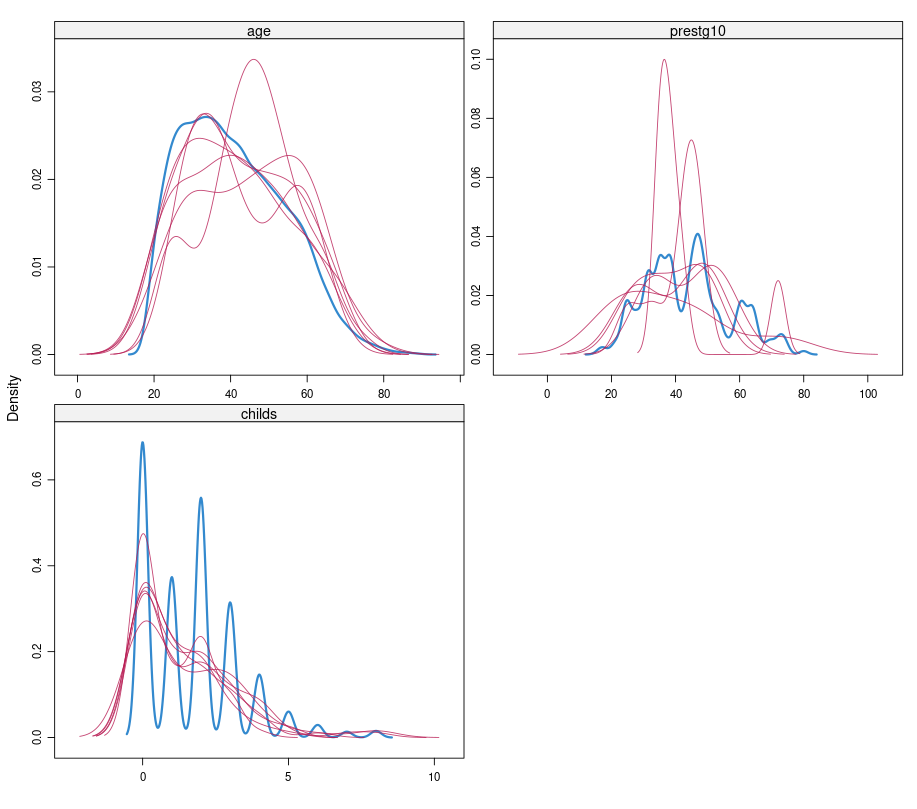
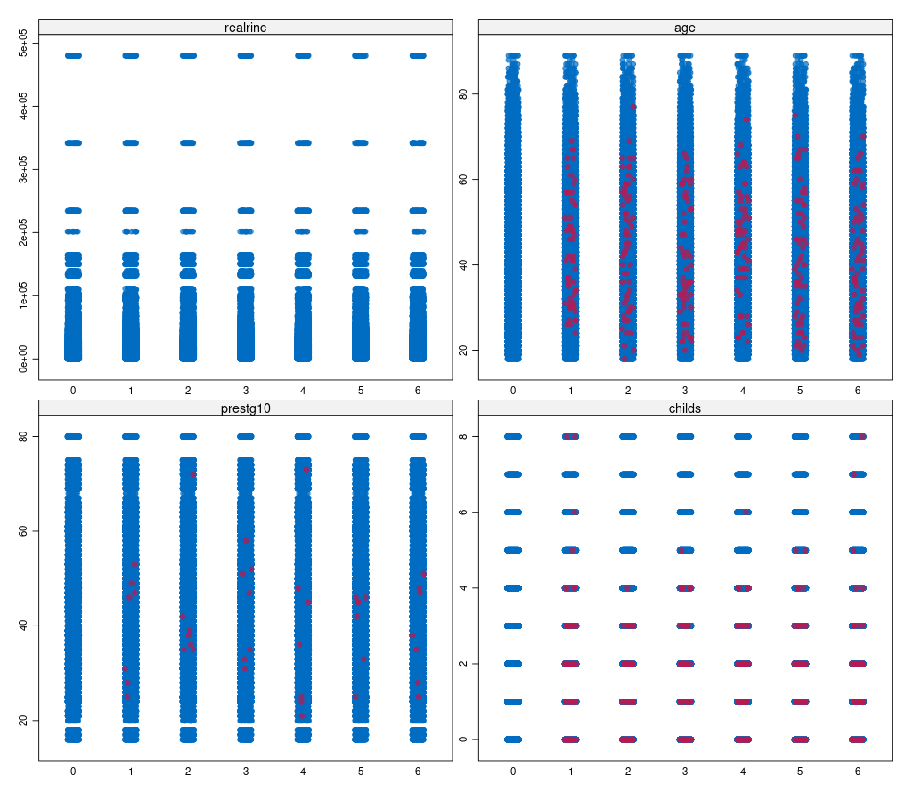
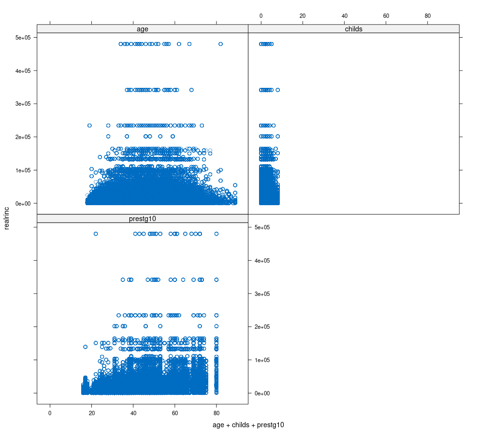

# gender_pay_gap_project

This is a project of the **Statistical Learning** course. The main goal is to apply different types of algorithm in order to predict the wage of a person. This project apply some linear algorithms and tree-based methods to predict the income of the people based on some features.

## Imputation methods - Results

-------------------------------------

-------------------------------------
